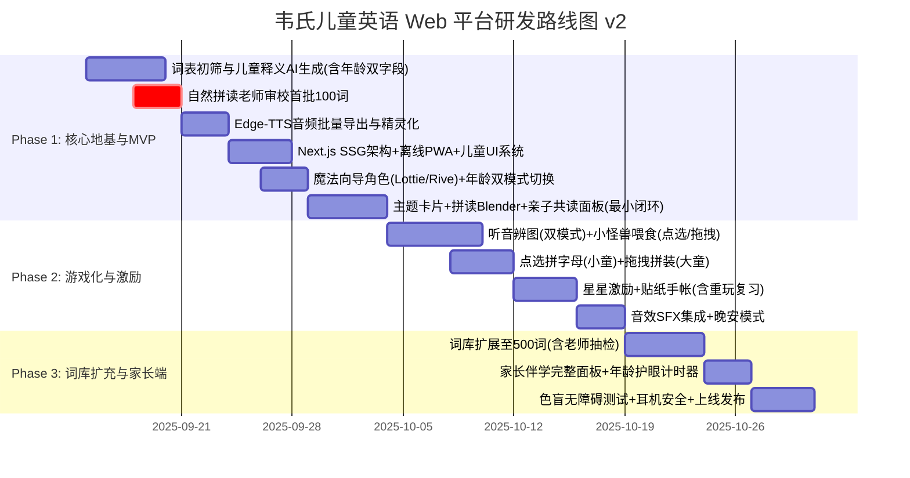

# 韦氏儿童英语 Web 学习平台项目规划方案
> **针对群体**：4～9 岁低幼及小学低年级儿童（Pre-K 至 Grade 3）  
> **项目定位**：启蒙化、多感官、游戏化的 Web 端儿童英语词汇与自然拼读乐园  
> **版本**：v2.0.0  
> **日期**：2025 年 9 月  
> **本次更新**：儿童视角深度评审后全面优化（年龄双模式分层、魔法向导、亲子共读、无障碍增强等）

---

## 目录
- [零、 年龄分层与双模式架构（核心新增）](#零-年龄分层与双模式架构核心新增)
- [一、 项目背景与核心认知纠偏](#一-项目背景与核心认知纠偏)
- [二、 教学法与儿童认知设计原则](#二-教学法与儿童认知设计原则)
- [三、 核心功能模块设计](#三-核心功能模块设计)
- [四、 词库与数据工程架构](#四-词库与数据工程架构)
- [五、 儿童交互与视觉音效设计规范（UI/UX）](#五-儿童交互与视觉音效设计规范uiux)
- [六、 技术架构与选型方案](#六-技术架构与选型方案)
- [七、 实施路线图与里程碑（Milestones）](#七-实施路线图与里程碑milestones)
- [八、 安全、防沉迷与家长控制](#八-安全防沉迷与家长控制)

---

## 零、 年龄分层与双模式架构（核心新增）

> **为什么必须分层？** 4 岁（不识字、精细动作弱）与 9 岁（能自主阅读段落）本质上是两种完全不同的用户。如果不加区分，低龄段够不着、高龄段觉得无聊。

### 0.1 三段认知画像

| 维度 | 🎈 小童模式 (4~5 岁 Pre-K) | 🌱 中童模式 (6~7 岁 G1) | 📖 大童模式 (8~9 岁 G3) |
|:---|:---|:---|:---|
| 识字能力 | 不认字，完全靠图与声音 | 认识部分简单词 | 可自主阅读 3~5 句段落 |
| 精细动作 | 只能**点、滑**，拖拽失败率极高 | 能做简单拖拽 | 流畅拖拽与键盘输入 |
| 注意力时长 | **3~8 分钟** | 8~12 分钟 | 12~20 分钟 |
| 拼读接受度 | 字母音启蒙 | 音素拼合 | 可做拼写练习 |
| 操作模式 | 纯点触、无文字指令 | 点触为主、少量文字 | 拖拽拼写、跟读、阅读 |

### 0.2 前台双模式实现策略

系统启动时提供两个入口（可由家长设置，也可根据年龄选择自动适配）：

```
🎈 小童模式 (4-6 岁)           📖 大童模式 (7-9 岁)
─────────────────────────     ─────────────────────────
• 纯点触交互，无拖拽           • 支持拖拽拼字母
• 无文字菜单，全靠语音+动画指导  • 有简体文字标签辅助
• 无拼写游戏，仅听音辨图        • 字母拼装 + 简单跟读
• 超大按钮 (≥80px)             • 标准大按钮 (≥64px)
• 8 分钟自动休息提醒           • 15-18 分钟休息提醒
• 魔法向导全程配音引导          • 向导可关闭
```

### 0.3 年龄开关实现

- **首次启动**：弹出友好的家长初始设置页（非强制，可跳过），家长为孩子选择年龄段。
- **运行时切换**：在设置角（需长按 3 秒或解简单算术）中可切换模式。
- **数据 Schema 标记**：每个单词携带 `minAge` / `maxAge` 字段，前端按当前模式过滤内容复杂度与交互方式。

---

## 一、 项目背景与核心认知纠偏

### 1.1 避免"1913 公版韦氏词典"陷阱
在开源社区（如 GitHub）上，绝大多数以 "Webster's English Dictionary" 命名的 JSON 词典项目（如 `ssvivian/WebstersDictionary` 或 `matthewreagan/WebstersEnglishDictionary`）其底层均为 **1913 年古董公版韦氏大词典（Unabridged Dictionary）**。
- **致命缺陷**：其词汇释义包含大量 19 世纪过时语汇、拉丁学名及繁冗复杂的学术语法（例如 `dog` 的释义为 *"A quadruped of the genus Canis, as the domestic dog..."*）。
- **正确策略**：现代《Merriam-Webster's Children's Dictionary》享有严格版权。本项目**不直接使用 1913 公版古董释义**，而是汲取韦氏儿童词典的编写精髓——**"用孩子日常能懂的词解释新词"、"注重情境例句"、"结合发音与拼读音素"**，通过现代化大模型批量生成符合 CEFR Pre-A1/A1 水准的专属儿童词库。

### 1.2 拒绝成人向 SaaS 化界面
低年级儿童尚未具备键盘盲打能力与抽象逻辑检索能力，传统的"顶部搜索框 + 文本列表 + 艾宾浩斯刷词卡"模式在儿童端完全失效。本项目坚持**"看图探索、听音输入、动效交互、关卡反馈"**的低幼认知路径。

### 1.3 核心差异化：年龄双模式 + 魔法向导 + 亲子共读
本方案在一众儿童英语项目中，以三大差异化设计确立独特性：
- **年龄双模式自适应**：一套代码，两种体验，低龄不挫败、高龄不无聊。
- **魔法向导角色全程陪伴**：固定卡通形象用语音 + 动画手势指引每一步，解决低龄儿童"看不懂菜单"的核心痛点。
- **亲子共读面板**：Phase 1 即内建，而非到 Phase 3 才后加——同一屏幕分上下半区，孩子看图听音，家长看教学提示。

---

## 二、 教学法与儿童认知设计原则

```
              ┌──────────────────────────────────────┐
              │   儿童语言习得三角 (Language Triad)   │
              └──────────────────┬───────────────────┘
                                 │
         ┌───────────────────────┼───────────────────────┐
         ▼                       ▼                       ▼
 1. 自然拼读 (Phonics)    2. 高频词 (Sight Words)   3. 情境映射 (Immersion)
 音素拆解与拼读直觉        Dolch/Fry 无阻碍认读       视觉、声效与生活场景关联
```

1. **多感官联动（Multisensory Learning）**：
   - **看**：手绘童趣矢量大图，拒绝生硬实物库存照。
   - **听**：儿童亲和度极高的神经网络童声音色（Edge-TTS `en-US-AnaNeural`）。
   - **触/动**：每次点击均有物理微弹动效、轻快 Pop 音效与粒子爆发反馈。
2. **自然拼读强化（Phonics-First）**：
   - 每个单词均拆解为音素音节（Syllables / Phonics Blends），支持单音素点击发音与整词连读。
   - **音素拆分质量控制**：首批 100 词拆分需经有儿童自然拼读教学经验的老师审校。见 [4.2 数据生成管道——第 4 步](#42-数据生成与精炼管道data-pipeline)。
3. **沉浸式主题探索（Thematic Immersion）**：
   - 摒弃枯燥的 A-Z 字典树检索，按孩子熟悉的生活主题分类（动物庄园、美食天地、家庭成员、神奇自然、缤纷色彩）。
   - **渐进式解锁**：首次进入仅开放 1 个主题场景，其余场景为低饱和度剪影，随探索进度逐步点亮，避免选择焦虑。
4. **正向即时反馈（Positive Reinforcement）**：
   - 杜绝惩罚性红叉或挫败音效；错误时使用温和提示音与魔法向导动画摇晃引导再试一次；正确时获得星星（Stars）、贴纸（Stickers）与掌声。
5. **魔法向导引导（Guided Discovery）**：
   - 固定卡通角色（如猫头鹰 Ollie 或小狐狸 Fifi）贯穿全局，通过**语音旁白 + 动画手势（指向、拍手、跳跃）**引导儿童完成每一步操作，消除"不知道点哪里"的迷茫。
6. **亲子共读优先（Parent-Child Co-Learning）** ⭐新增：
   - 不假设孩子独立使用。每张单词卡片底部内置 `👨‍👧 亲子模式` 开关：打开后屏幕下半区展示教学提示（如"跟孩子说：What color is the apple? 指一指红色的苹果在哪里？"），让家长从"监督者"变成"参与者"。

---

## 三、 核心功能模块设计

### 模块零：魔法向导系统（Magic Guide）⭐核心新增
- **功能描述**：贯穿全局的固定卡通动画角色，是低幼儿童理解界面的"翻译官"。
- **角色设计**：选定一个可爱动物形象（建议猫头鹰 Ollie——聪明、可信、与"韦氏词典"的学术调性暗合但以萌化方式呈现）。
- **引导机制**：
  - 场景初始化时，向导从屏幕角落飞入，用语音介绍当前场景（如"嗨！这里是动物庄园，一起来认识小动物们吧！"）。
  - 当儿童静止超过 8 秒无操作，向导轻微跳跃并说："试试点点那只喵喵叫的小猫咪吧！"
  - 答对时向导鼓掌撒花；答错时向导温和摇头："差一点点，再试一次！"
  - 大童模式（7+）中，向导默认静默到角落，可点击唤醒。
- **技术实现**：
  - Lottie / Rive 动画驱动的矢量角色（体积小、缩放无损）。
  - 音频队列管理：向导语音不打断单词发音，通过音频精灵调度。

### 模块一：主题探索乐园（Theme Explorer）
- **功能描述**：首页呈现童话风格场景卡片，每次仅突出显示当前解锁场景。
- **渐进式解锁机制**：
  - 🆕 首次进入仅展示 **1 个高亮场景**（如"动物庄园"），其余场景显示为低饱和度灰色剪影，标注"？"。
  - 每完成当前场景 **5~8 个词汇**后，下一场景自动彩色点亮并伴随魔法向导欢呼："哇！你解锁了美食天地！"。
- **交互方式**：
  - 点击场景进入全景探索画布（Canvas / SVG），场景内物品悬停/点触时有轻微跳动。
  - 点击场景中的猫咪、苹果、桌子，直接触发发音并弹出趣味微卡片。

### 模块二：字母与拼读泡泡岛（Phonics Island）
- **功能描述**：26 个色彩缤纷的字母小岛。
- **核心组件**：
  - **音素分解器（Phonics Blender）**：
    - 单词如 `C - A - T` 呈现为三个连贯气球。点击 `C` 发 `/k/`，点击 `A` 发 `/æ/`，点击 `T` 发 `/t/`；点击播放键将气球融合成小猫，发出整词音与喵叫声。
    - 🆕 **双粒度切换**：家长可在设置中选择"音素级展示"（phoneme，如 /k/ /æ/ /t/）或"字母拼写级展示"（grapheme，如 c-a-t），默认大童模式用音素级、小童模式用字母级。
  - **元音与辅音区分（形状 + 颜色双通道）**：
    - 元音：🔴 红色**圆形**气泡
    - 辅音：🔵 蓝色**方形**气泡
    - 不纯靠颜色，确保约 5% 的色盲儿童也能区分。

### 模块三：多感官魔法卡片（Interactive Word Card）
- **展示内容**：
  - 超大趣味手绘插图（支持点击二次动画）。
  - 儿童韦氏释义（一句话童言童语，如 *"A soft pet that says meow."*）。
  - 慢速与常速发音切换（乌龟图标：0.75x 慢速拼读；小兔图标：1.0x 正常连读）。
  - 🆕 **亲子共读面板**：卡片底部可展开，下半区对家长展示教学提示（如"引导孩子说出这个单词的第一个音是什么？"）、上半区保持儿童视图不变。纯前端 UI 布局变化，无需后端。
- 🆕 **跟读模式调整**（与原方案的重要区别）：
  - ~~Web Speech Recognition 自动打分~~ ❌ 放弃。浏览器语音识别对儿童声线准确率极低，4 岁孩子口齿不清时几乎不可用。
  - ✅ 改为**录音回放 + 自我对比**：录下孩子的声音 → 立即回放 → 接着播放标准发音 → 魔法向导问"你觉得一样吗？想再试一次吗？"——让孩子自己判断，不给机器评分，避免挫败感。
  - 在 FAQ 中明确标注：跟读功能建议 6+ 且在安静环境使用。

### 模块四：游戏化巩固乐园（Game Arcade）

> 🆕 **交互方式自适应**：小童模式统一使用"点选"（tap），大童模式开放"拖拽"（drag）。

1. **听音捉迷藏（Listen & Tap）** [双模式通用]：
   - 系统播放单词语音，屏幕浮动 3~4 张卡通图画，孩子轻触正确图画，触发星星爆炸特效。
   - 小童模式：3 张图、无倒计时；大童模式：4 张图、15 秒倒计时。
2. **字母拼装小火车（Spelling Train）** [大童模式专属]：
   - 乱序字母车厢，孩子拖拽车厢拼接成目标单词。
   - 🆕 **小童模式替代方案——点选拼字母（Tap to Spell）**：字母车厢按顺序排列，孩子依次点击 A → P → P → L → E，每点一个发出对应字母音（phonics sound，非字母名），点完自动拼合发音。
3. **小怪兽喂食记（Feed the Monster）** [大童：拖拽 / 小童：点选]：
   - 小怪兽喊出想吃的物品英文（如 *"I want a red apple!"*），孩子拖动对应物品喂食。
   - 小童模式：3 个物品排列，直接点选即可喂食；大童模式：5 个物品分散，需拖拽。

### 模块五：贴纸图鉴与成就树（Sticker Book & Rewards）
- **虚拟激励**：每次完成 3~5 个词汇探索，解锁一张精美卡通行星或小动物贴纸。
- **贴纸册**：孩子可在画布上自由拖拽布置自己的专属小天地。
- 🆕 **贴纸重玩价值**：每张已获得的贴纸，点击后触发该贴纸对应词汇的复习发音与小动画（如小猫贴纸被点击后发出"meow~ cat!"并抖动），让旧贴纸永远有价值而非一次性消耗品。

### 模块六：晚安舒缓模式（Bedtime Mode）⭐新增
- **触发方式**：设置面板中开启，或根据系统时间自动提示（如 19:00 后）。
- **模式变更**：
  - 禁用所有兴奋类音效（鼓掌、撒花、金币），仅保留轻柔点击音。
  - 屏幕色温切换至暖黄护眼色调（类似 Night Shift）。
  - 仅开放"单词卡片浏览"与"听发音"功能，关闭所有计时与游戏。
  - 魔法向导语音切换为轻柔耳语模式。
- **场景**：睡前亲子共读、车上安静浏览。

### 模块七：家长伴学面板（Parent Dashboard）⭐从 Phase 3 提前至 Phase 1
- **基础版（Phase 1 交付）**：
  - 亲子共读模式（模块三中已述）。
  - 年龄模式初始设置页。
- **完整版（Phase 2~3 迭代）**：
  - 学习进度统计（已解锁词汇数、点亮主题数、获得贴纸数）。
  - 护眼计时器配置（按年龄段设定提醒阈值）。
  - 音量上限设置与耳机安全保护开关。

---

## 四、 词库与数据工程架构

### 4.1 核心数据结构规范（Word Data Schema v2）

```json
{
  "$schema": "http://json-schema.org/draft-07/schema#",
  "wordId": "w_apple_001",
  "word": "apple",
  "emoji": "🍎",
  "theme": "food",
  "gradeLevel": "K-1",
  "minAge": 4,
  "maxAge": 9,
  "sightWord": true,
  "phonics": {
    "ipa": "/ˈæp.əl/",
    "displaySpelling": "A-p-p-l-e",
    "phonemeSegments": [
      { "phoneme": "æ", "audio": "/audio/phonics/a_short.mp3" },
      { "phoneme": "p", "audio": "/audio/phonics/p.mp3" },
      { "phoneme": "əl", "audio": "/audio/phonics/el.mp3" }
    ],
    "graphemeSegments": [
      { "letter": "a", "phoneme": "æ", "audio": "/audio/phonics/a_short.mp3" },
      { "letter": "p", "phoneme": "p", "audio": "/audio/phonics/p.mp3" },
      { "letter": "p", "phoneme": "p", "audio": "/audio/phonics/p.mp3" },
      { "letter": "l", "phoneme": "l", "audio": "/audio/phonics/l.mp3" },
      { "letter": "e", "phoneme": "ə", "audio": "/audio/phonics/schwa_e.mp3" }
    ]
  },
  "syllables": ["ap", "ple"],
  "kidDefinition": {
    "en_young": "A yummy round fruit. You can bite it!",
    "en_older": "A round, crunchy fruit that can be red, green, or yellow.",
    "zh": "一种又圆又脆的水果，有红色的、绿色的或黄色的。"
  },
  "exampleSentence": {
    "en": "I love eating a crunchy red apple!",
    "zh": "我喜欢吃脆生生的红苹果！",
    "audio": "/audio/sentences/apple_ex.mp3"
  },
  "illustration": "/images/words/apple.webp",
  "sfx": "/sfx/crunch.mp3",
  "parentTip": {
    "en": "Ask your child: What color is the apple? Can you find something red in the room?",
    "zh": "问问孩子：苹果是什么颜色的？房间里能找到红色的东西吗？"
  }
}
```

> **Schema v2 关键变更**：
> 1. 新增 `minAge` / `maxAge` 字段支持年龄分层过滤。
> 2. 新增 `displaySpelling` 字段，IPA 仅做内部存储，**不再展示给儿童**。
> 3. 拆分 `phonemeSegments`（音素级）与 `graphemeSegments`（字母拼写级），前端按模式选择展示。
> 4. 新增 `en_young`（4-6 岁简化释义）与 `en_older`（7-9 岁标准释义）双字段。
> 5. 新增 `parentTip` 字段为亲子共读面板提供教学提示内容。

### 4.2 数据生成与精炼管道（Data Pipeline）
1. **词表遴选**：
   - **基础源**：Dolch Sight Words (220词) + Fry First 300 Words + 国内小学人教版新课标 PEP 一至三年级核心词汇，形成首批精选 **500 词白名单**。
2. **AI 辅助儿童化编写（LLM Prompting）**：
   - 编写定制化 System Prompt，约束语言模型以《Merriam-Webster's Elementary Dictionary》标准：
     * 严禁使用生僻多音节词解释；
     * 释义控制在 10 词以内的完整单句；
     * 包含感官动词（look, smell, taste, sound, play）；
     * 同时生成 `en_young`（5 词以内，纯感官描述）与 `en_older`（10 词以内，简单句）。
3. **高质量离线语音预合成**：
   - 采用 Microsoft Edge-TTS 引擎，批量输出 `en-US-AnaNeural`（活泼女童音）与 `en-US-ChristopherNeural`（自然男童音）两套纯正发音 MP3。
4. 🆕 **儿童自然拼读老师审校**：
   - 首批 100 词的音素拆分（phonemeSegments / graphemeSegments）必须经过 **有儿童自然拼读（Phonics）教学经验的专业老师** 或 **持有 TEFL/TESOL 少儿教学认证的编辑** 逐词审校，防止 AI 生成的音素拆分出现语言学错误（如将 `blue` 错误拆为 `bl` + `ue` 而非 `b` + `l` + `ue` 的合理拼写映射）。
   - 后续批次可改为抽检（每 50 词抽 5 词）。

---

## 五、 儿童交互与视觉音效设计规范（UI/UX）

| 设计维度 | 规范标准 | 落地措施 |
| :--- | :--- | :--- |
| **字体系统 (Typography)** | 圆润、无衬线、童趣高辨识度 | 英文优先采用 `Fredoka`、`Nunito`、`Quicksand`；中文采用 `ZCOOL KuaiLe` 或 `苹方/微软雅黑圆体`。字号基础 20px 以上，单词展示 48~64px。 |
| **色彩搭配 (Color Palette)** | 活力马卡龙、高辨识度双色阶 | 主背景：柔和米奶黄 `#FFFDF5`（护眼防疲劳）；主要功能色：明黄 `#FFD13B`、天蓝 `#4D96FF`、糖果粉 `#FF6B6B`、薄荷绿 `#6BCB77`。🆕 晚安模式色温：暖黄低蓝光 `#FFF8E7`。 |
| **触控与热区 (Touch Targets)** | 超大可点控尺寸（Fitts's Law） | 小童模式：最小 `80px × 80px`，间距 ≥ `16px`；大童模式：最小 `64px × 64px`，间距 ≥ `12px`。 |
| **音效反馈 (Audio Feedback)** | 即时、清脆、情绪激励 | 引入 `Howler.js`：<br>• 按钮悬浮/轻触：`pop.mp3`（水滴爆破音）<br>• 答对奖励：`chime_success.mp3`（风铃清脆三连音）<br>• 获得星星：`star_coin.mp3`（吃金币动听音）。<br>🆕 晚安模式禁用兴奋音效，仅留轻柔 tap 音。 |
| **转场与微动效 (Motion)** | Q 弹物理感知，拒绝突兀跳转 | 采用 `Framer Motion`，所有卡片展开带 spring 物理弹簧属性（stiffness: 300, damping: 20），点击有向内微压反馈（scale: 0.94）。 |
| 🆕 **无障碍：色盲友好 (Color-Blind Accessibility)** | 关键信息不纯靠颜色传达 | 音素气泡使用**形状 + 颜色双通道编码**（元音 = 红色圆形，辅音 = 蓝色方形）；正确/错误反馈同时使用图标变化（✅/🔄）和音效，不只靠绿/红区分。 |
| 🆕 **耳机安全 (Headphone Safety)** | 防止儿童耳机高分贝损伤听力 | 家长面板可设置最大音量上限（默认 75dB 等效）；插入/拔出耳机时自动平滑过渡音量，杜绝爆音。 |

---

## 六、 技术架构与选型方案

```
                                  [ Web 客户端 (Next.js 14 App Router) ]
                                                     │
                 ┌───────────────────────────────────┼───────────────────────────────────┐
                 ▼                                   ▼                                   ▼
         [ 视觉与动效表现层 ]                [ 核心逻辑与状态 ]                   [ 多媒体音频引擎 ]
    TailwindCSS + Fredoka Font               Zustand (轻量响应式)                  Howler.js (音效精灵)
   Framer Motion (物理弹性微动)            IndexedDB (本地离线进度)             Web Audio / Web Speech API
    Lottie / Rive (魔法向导动画)          ageMode Store (双模式切换)
```

### 6.1 技术栈清单
- **前端框架**：`Next.js 14 (App Router)` + `TypeScript`
- **样式方案**：`TailwindCSS` + 自定义儿童调色盘与圆角系统（`rounded-3xl` / `rounded-full` 为主）
- **动效库**：`Framer Motion`（页面微动效与卡片转场）、`canvas-confetti`（过关撒花粒子）、`Lottie` / `Rive`（魔法向导角色动画）
- **音频引擎**：`Howler.js`（管理界面 SFX 音效精灵与多轨道播放，避免 iOS/Safari 音频延迟）
- **本地存储与离线化**：`IndexedDB (Dexie.js)` + `LocalStorage`（记录孩子已点亮星数、贴纸图鉴、年龄模式偏好，支持完全免登录本地游玩）
- 🆕 **打包与部署（离线优先）**：静态导出（`output: 'export'`）+ Service Worker（PWA），从 **Phase 1 即采用 SSG 架构**（静态站点生成），确保无需后端即可在飞机、汽车等离线场景使用。部署于 Vercel / Cloudflare Pages / GitHub Pages。

### 6.2 架构原则
1. **纯前端、零后端**：所有学习数据静态打包，用户进度存本地 IndexedDB，无需服务器。
2. **离线优先（Offline-First）**：Phase 1 即以 PWA + Service Worker 为默认架构，而非后加。
3. **静态导出**：Next.js `output: 'export'`，部署为零成本的纯静态站点。

---

## 七、 实施路线图与里程碑（Milestones）



### 阶段详细说明：

- **Phase 1: 核心地基与 MVP 验证（约 3 周）**
  - 完成首批 100 个核心词汇数据（含 `en_young`/`en_older` 双释义、音素与字母双拆分、亲子教学提示）。
  - 🆕 **自然拼读老师审校**首批 100 词音素拆分（关键质量闸门）。
  - 实现"年龄双模式切换"、"魔法向导角色动画引导"、"主题渐进解锁浏览"与"多感官单词展示大卡片"。
  - 🆕 亲子共读面板作为 Phase 1 基础功能（非 Phase 3 后加）。
  - 🆕 架构即 PWA + SSG 静态导出，离线可用。

- **Phase 2: 游戏化与激励闭环（约 2 周）**
  - 上线"听音选图"（双模式通用）、"点选拼字母"（小童）/ "拖拽拼装火车"（大童）、"小怪兽喂食"（点选/拖拽自适应）。
  - 完成星星收集、贴纸画板（含重玩复习触发）及粒子反馈特效。
  - 🆕 晚安舒缓模式上线。

- **Phase 3: 词库扩容、家长端与全面交付（约 2 周）**
  - 词库扩充至 500~800 词（每 50 词抽检 5 词）。
  - 家长伴学完整面板（进度统计、年龄段护眼计时器配置、音量上限与耳机安全）。
  - 🆕 色盲无障碍测试、全平台兼容测试。
  - PWA 发布，平板及大屏设备一键安装至桌面。

---

## 八、 安全、防沉迷与家长控制

1. **COPPA / 儿童隐私保护**：
   - 平台默认免登录即可使用全部学习功能；
   - 不采集儿童面部、精细地理位置或设备唯一识别码；
   - 零第三方商业广告、零外链跳转。
2. 🆕 **护眼防沉迷（Screen Time Guard）——年龄段自适应**：
   - 不再一刀切 20 分钟，改为按年龄段分档：

   | 年龄段 | 提醒阈值 | 行为 |
   |:---|:---|:---|
   | 4~5 岁 | **8 分钟** | 魔法向导轻声提醒"小眼睛休息一下吧！"，建议休息但不强制锁定 |
   | 6~7 岁 | **12 分钟** | 弹窗提醒 + 可选"再玩 3 分钟"或"去休息" |
   | 8~9 岁 | **18 分钟** | 弹窗提醒 + 温和锁定 3 分钟 |

   - 每轮休息后魔法向导会说"欢迎回来！我们继续冒险吧！"

3. **音量保护机制**：
   - 默认限制最大输出音量平缓，杜绝突发高分贝刺耳杂音。
   - 🆕 **耳机安全**：家长面板设置最大音量上限；插入/拔出耳机时平滑过渡音量。

---

> **结语**：本项目旨在让儿童通过探索与游戏，重塑与英语词汇的初次相遇，让"查词典"从枯燥的学习任务变为一场生动的童话冒险。

---

## 附录：v2.0 相较 v1.0 核心变更清单

| # | 变更类型 | 变更内容 |
|:---|:---|:---|
| 1 | 🔴 新增 | 年龄双模式分层架构（小童 4-6 / 大童 7-9），交互复杂度、内容深度、护眼阈值全区分 |
| 2 | 🔴 新增 | 魔法向导系统（Lottie/Rive 动画角色全程语音引导） |
| 3 | 🔴 新增 | 亲子共读面板（Phase 1 即内建，非后加） |
| 4 | 🔴 新增 | 主题渐进式解锁（首次只开 1 个场景，避免信息过载） |
| 5 | 🔴 新增 | 晚安舒缓模式（禁用兴奋音效、暖黄色温、仅卡片浏览） |
| 6 | 🟡 修改 | 拼读拆分双粒度（音素级 / 字母拼写级），前端按模式选择 |
| 7 | 🟡 修改 | 放弃 Web Speech Recognition 自动打分 → 改为录音回放 + 自我对比 |
| 8 | 🟡 修改 | 低龄模式拖拽 → 点选（字母拼装、小怪兽喂食均提供点选替代） |
| 9 | 🟡 修改 | 色盲无障碍：形状 + 颜色双通道编码，不只靠颜色区分 |
| 10 | 🟡 修改 | 护眼计时从 20 分钟一刀切 → 8/12/18 分钟三档 |
| 11 | 🟡 修改 | 架构从"Phase 3 加 PWA" → Phase 1 即 SSG + Service Worker 离线优先 |
| 12 | 🟢 优化 | 贴纸增加重玩复习价值（点击触发词汇发音与小动画） |
| 13 | 🟢 优化 | IPA 音标不展示给儿童；Data Schema 增加 `minAge`/`maxAge`/`parentTip`/`en_young` 字段 |
| 14 | 🟢 优化 | 增加耳机安全保护机制 |
| 15 | 🟢 优化 | 自然拼读老师审校步骤纳入 Data Pipeline（首批 100 词必须全审） |