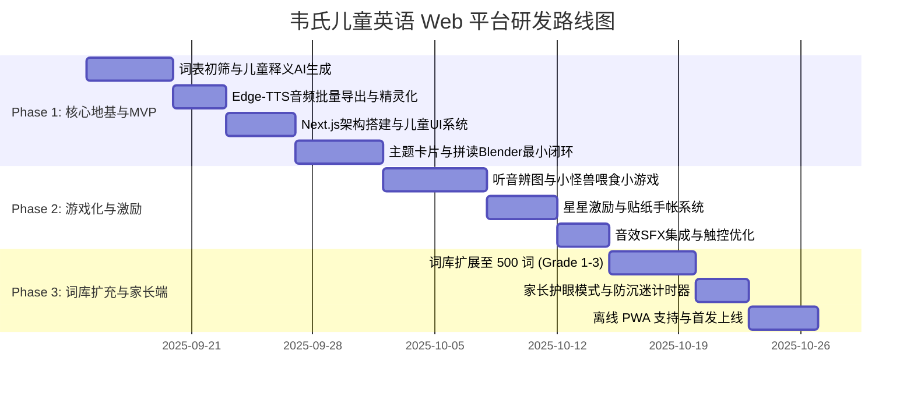

# 韦氏儿童英语 Web 学习平台项目规划方案
> **针对群体**：4～9 岁低幼及小学低年级儿童（Pre-K 至 Grade 3）  
> **项目定位**：启蒙化、多感官、游戏化的 Web 端儿童英语词汇与自然拼读乐园  
> **版本**：v1.0.0  
> **日期**：2025 年 9 月  

---

## 目录
- [一、 项目背景与核心认知纠偏](#一-项目背景与核心认知纠偏)
- [二、 教学法与儿童认知设计原则](#二-教学法与儿童认知设计原则)
- [三、 核心功能模块设计](#三-核心功能模块设计)
- [四、 词库与数据工程架构](#四-词库与数据工程架构)
- [五、 儿童交互与视觉音效设计规范（UI/UX）](#五-儿童交互与视觉音效设计规范uiux)
- [六、 技术架构与选型方案](#六-技术架构与选型方案)
- [七、 实施路线图与里程碑（Milestones）](#七-实施路线图与里程碑milestones)
- [八、 安全、防沉迷与家长控制](#八-安全防沉迷与家长控制)

---

## 一、 项目背景与核心认知纠偏

### 1.1 避免“1913 公版韦氏词典”陷阱
在开源社区（如 GitHub）上，绝大多数以 "Webster's English Dictionary" 命名的 JSON 词典项目（如 `ssvivian/WebstersDictionary` 或 `matthewreagan/WebstersEnglishDictionary`）其底层均为 **1913 年古董公版韦氏大词典（Unabridged Dictionary）**。
- **致命缺陷**：其词汇释义包含大量 19 世纪过时语汇、拉丁学名及繁冗复杂的学术语法（例如 `dog` 的释义为 *"A quadruped of the genus Canis, as the domestic dog..."*）。
- **正确策略**：现代《Merriam-Webster's Children's Dictionary》享有严格版权。本项目**不直接使用 1913 公版古董释义**，而是汲取韦氏儿童词典的编写精髓——**“用孩子日常能懂的词解释新词”、“注重情境例句”、“结合发音与拼读音素”**，通过现代化大模型批量生成符合 CEFR Pre-A1/A1 水准的专属儿童词库。

### 1.2 拒绝成人向 SaaS 化界面
低年级儿童尚未具备键盘盲打能力与抽象逻辑检索能力，传统的“顶部搜索框 + 文本列表 + 艾宾浩斯刷词卡”模式在儿童端完全失效。本项目坚持**“看图探索、听音输入、动效交互、关卡反馈”**的低幼认知路径。

---

## 二、 教学法与儿童认知设计原则

```
              ┌──────────────────────────────────────┐
              │   儿童语言习得三角 (Language Triad)   │
              └──────────────────┬───────────────────┘
                                 │
         ┌───────────────────────┼───────────────────────┐
         ▼                       ▼                       ▼
 1. 自然拼读 (Phonics)    2. 高频词 (Sight Words)   3. 情境映射 (Immersion)
 音素拆解与拼读直觉        Dolch/Fry 无阻碍认读       视觉、声效与生活场景关联
```

1. **多感官联动（Multisensory Learning）**：
   - **看**：手绘童趣矢量大图，拒绝生硬实物库存照。
   - **听**：儿童亲和度极高的神经网络童声音色（Edge-TTS `en-US-AnaNeural`）。
   - **触/动**：每次点击均有物理微弹动效、轻快 Pop 音效与粒子爆发反馈。
2. **自然拼读强化（Phonics-First）**：
   - 每个单词均拆解为音素音节（Syllables / Phonics Blends），支持单音素点击发音与整词连读。
3. **沉浸式主题探索（Thematic Immersion）**：
   - 摒弃枯燥的 A-Z 字典树检索，按孩子熟悉的生活主题分类（动物庄园、美食天地、家庭成员、神奇自然、缤纷色彩）。
4. **正向即时反馈（Positive Reinforcement）**：
   - 杜绝惩罚性红叉或挫败音效；错误时使用温和提示音与动画摇晃引导再试一次；正确时获得星星（Stars）、贴纸（Stickers）与掌声。

---

## 三、 核心功能模块设计

### 模块一：主题探索乐园（Theme Explorer）
- **功能描述**：首页呈现儿童手绘世界地图，分为若干个可点击的冒险场景（如 *Safari Park*, *Sweet Kitchen*, *Magic Classroom* 等）。
- **交互方式**：
  - 点击场景进入全景探索画布（Canvas / SVG），场景内物品悬停/点触时会有轻微跳动。
  - 点击场景中的猫咪、苹果、桌子，直接触发发音并弹出趣味微卡片。

### 模块二：字母与拼读泡泡岛（Phonics Island）
- **功能描述**：26 个色彩缤纷的字母小岛。
- **核心组件**：
  - **音素分解器（Phonics Blender）**：单词如 `C - A - T` 呈现为三个连贯气球。点击 `C` 发 `/k/`，点击 `A` 发 `/æ/`，点击 `T` 发 `/t/`；点击播放键将气球融合成小猫，发出整词音与喵叫声。
  - **元音与辅音色彩区分**：元音（红/粉暖色）、辅音（蓝/绿冷色），直观强化拼读感知。

### 模块三：多感官魔法卡片（Interactive Word Card）
- **展示内容**：
  - 超大趣味手绘插图（支持点击二次动画）。
  - 儿童韦氏释义（一句话童言童语，如 *"A soft pet that says meow."*）。
  - 慢速与常速发音切换（乌龟图标：0.75x 慢速拼读；小兔图标：1.0x 正常连读）。
  - 趣味短句与录音跟读比对（基于 Web Speech Recognition 进行简单发音趣味匹配）。

### 模块四：游戏化巩固乐园（Game Arcade）
1. **听音捉迷藏（Listen & Tap）**：
   - 系统播放单词语音，屏幕浮动 3~4 张卡通图画，孩子在倒计时前轻触正确图画，触发星星爆炸特效。
2. **字母拼装小火车（Spelling Train）**：
   - 乱序字母车厢，孩子拖拽车厢拼接成目标单词。
3. **小怪兽喂食记（Feed the Monster）**：
   - 小怪兽会喊出想吃的物品英文（如 *"I want a red apple!"*），孩子拖动对应物品喂食。

### 模块五：贴纸图鉴与成就树（Sticker Book & Rewards）
- **虚拟激励**：每次完成 3~5 个词汇探索，解锁一张精美卡通行星或小动物贴纸。
- **贴纸册**：孩子可在画布上自由拖拽布置自己的专属小天地。

---

## 四、 词库与数据工程架构

### 4.1 核心数据结构规范（Word Data Schema）

为确保儿童学习的高效性，词库必须兼顾音标、音素拆解、儿童化释义与多媒体资源：

```json
{
  "$schema": "http://json-schema.org/draft-07/schema#",
  "wordId": "w_apple_001",
  "word": "apple",
  "phonics": {
    "ipa": "/ˈæp.əl/",
    "segments": [
      { "letter": "a", "sound": "æ", "audio": "/audio/phonics/a_short.mp3" },
      { "letter": "pp", "sound": "p", "audio": "/audio/phonics/p.mp3" },
      { "letter": "le", "sound": "əl", "audio": "/audio/phonics/el.mp3" }
    ]
  },
  "syllables": ["ap", "ple"],
  "kidDefinition": {
    "en": "A round, crunchy fruit that can be red, green, or yellow.",
    "zh": "一种圆圆脆脆的水果，有红色、绿色或黄色的。"
  },
  "exampleSentence": {
    "en": "I love eating a crunchy red apple!",
    "zh": "我喜欢吃脆生生的红苹果！",
    "audio": "/audio/sentences/apple_ex.mp3"
  },
  "theme": "food",
  "gradeLevel": "K-1",
  "sightWord": true,
  "illustration": "/images/words/apple.webp",
  "sfx": "/sfx/crunch.mp3"
}
```

### 4.2 数据生成与精炼管道（Data Pipeline）
1. **词表遴选**：
   - **基础源**：Dolch Sight Words (220词) + Fry First 300 Words + 国内小学人教版新课标 PEP 一至三年级核心词汇，形成首批精选 **500 词白名单**。
2. **AI 辅助儿童化编写（LLM Prompting）**：
   - 编写定制化 System Prompt，约束语言模型以《Merriam-Webster's Elementary Dictionary》标准：
     * 严禁使用生僻多音节词解释；
     * 释义控制在 10 词以内的完整单句；
     * 包含感官动词（look, smell, taste, sound, play）。
3. **高质量离线语音预合成**：
   - 采用 Microsoft Edge-TTS 引擎，批量输出 `en-US-AnaNeural`（活泼女童音）与 `en-US-ChristopherNeural`（自然男童音）两套纯正发音 MP3。

---

## 五、 儿童交互与视觉音效设计规范（UI/UX）

| 设计维度 | 规范标准 | 落地措施 |
| :--- | :--- | :--- |
| **字体系统 (Typography)** | 圆润、无衬线、童趣高辨识度 | 英文优先采用 `Fredoka`、`Nunito`、`Quicksand`；中文采用 `ZCOOL KuaiLe` 或 `苹方/微软雅黑圆体`。字号基础 20px 以上，单词展示 48~64px。 |
| **色彩搭配 (Color Palette)** | 活力马卡龙、高辨识度双色阶 | 主背景：柔和米奶黄 `#FFFDF5`（护眼防疲劳）；主要功能色：明黄 `#FFD13B`、天蓝 `#4D96FF`、糖果粉 `#FF6B6B`、薄荷绿 `#6BCB77`。 |
| **触控与热区 (Touch Targets)** | 超大可点控尺寸（Fitts's Law） | 所有主要交互元素最小尺寸 `64px × 64px`，外留至少 `12px` 间距，杜绝误触。 |
| **音效反馈 (Audio Feedback)** | 即时、清脆、情绪激励 | 引入 `Howler.js`：<br>• 按钮悬浮/轻触：`pop.mp3`（水滴爆破音）<br>• 答对奖励：`chime_success.mp3`（风铃清脆三连音）<br>• 获得星星：`star_coin.mp3`（吃金币动听音）。 |
| **转场与微动效 (Motion)** | Q 弹物理感知，拒绝突兀跳转 | 采用 `Framer Motion`，所有卡片展开带 spring 物理弹簧属性（stiffness: 300, damping: 20），点击有向内微压反馈（scale: 0.94）。 |

---

## 六、 技术架构与选型方案

```
                                  [ Web 客户端 (Next.js 14 App Router) ]
                                                     │
                 ┌───────────────────────────────────┼───────────────────────────────────┐
                 ▼                                   ▼                                   ▼
         [ 视觉与动效表现层 ]                [ 核心逻辑与状态 ]                   [ 多媒体音频引擎 ]
    TailwindCSS + Fredoka Font               Zustand (轻量响应式)                  Howler.js (音效精灵)
   Framer Motion (物理弹性微动)            IndexedDB (本地离线进度)             Web Audio / Web Speech API
```

### 6.1 技术栈清单
- **前端框架**：`Next.js 14 (App Router)` + `TypeScript`
- **样式方案**：`TailwindCSS` + 自定义儿童调色盘与圆角系统（`rounded-3xl` / `rounded-full` 为主）
- **动效库**：`Framer Motion`（页面微动效与卡片转场）、`canvas-confetti`（过关撒花粒子）
- **音频引擎**：`Howler.js`（管理界面 SFX 音效精灵与多轨道播放，避免 iOS/Safari 音频延迟）
- **本地存储与离线化**：`IndexedDB (Dexie.js)` + `LocalStorage`（记录孩子已点亮星数、贴纸图鉴，支持完全免登录本地游玩）
- **打包与部署**：静态导出（`output: 'export'`），可极速部署于 Vercel / Cloudflare Pages / GitHub Pages。

---

## 七、 实施路线图与里程碑（Milestones）



### 阶段详细说明：
- **Phase 1: 核心地基与 MVP 验证（2 周）**
  - 完成首批 100 个核心词汇数据（带音素拆解、儿童释义、手绘图标与纯正音频）。
  - 实现“主题分类浏览”与“多感官单词展示大卡片”。
- **Phase 2: 游戏化与激励闭环（2 周）**
  - 上线“听音选图”、“字母拼装”两款基础互动小游戏。
  - 完成星星收集、贴纸画板及粒子反馈特效。
- **Phase 3: 词库扩容、家长端与全面交付（2 周）**
  - 词库扩充至 500~800 词。
  - 增加家长伴学面板（学习进度统计、护眼定时提醒模式）。
  - 支持 PWA，平板及大屏设备一键安装至桌面。

---

## 八、 安全、防沉迷与家长控制

1. **COPPA / 儿童隐私保护**：
   - 平台默认免登录即可使用全部学习功能；
   - 不采集儿童面部、精细地理位置或设备唯一识别码；
   - 零第三方商业广告、零外链跳转。
2. **护眼防沉迷（Screen Time Guard）**：
   - 内置“护眼小卫士”计时器，默认连续学习 20 分钟后自动弹出卡通弹窗，提示：“小眼睛该休息啦，眺望远方看看绿色吧！”，锁定操作 3 分钟。
3. **音量保护机制**：
   - 默认限制最大输出音量平缓，杜绝突发高分贝刺耳杂音。

---

> **结语**：本项目旨在让儿童通过探索与游戏，重塑与英语词汇的初次相遇，让“查词典”从枯燥的学习任务变为一场生动的童话冒险。
