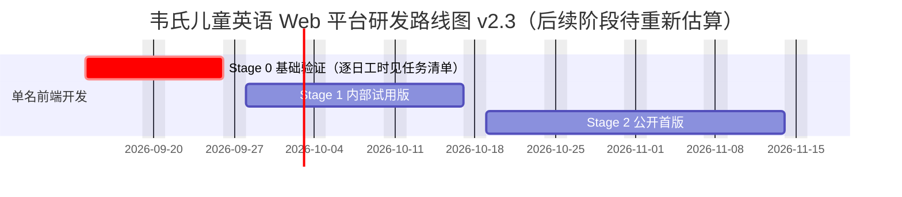

# 韦氏儿童英语 Web 学习平台项目规划方案

> **针对群体**：4～9 岁低幼及小学低年级儿童（Pre-K 至 Grade 3）
>
> **项目定位**：启蒙化、多感官、游戏化的 Web 端儿童英语词汇与自然拼读乐园
>
> **版本**：v2.3.2
>
> **日期**：2026 年 9 月
>
> **v2.3 更新（2026-09-10）**：补齐[实施规格](./IMPLEMENTATION_SPEC.md)、[Stage 0 任务与验收](./STAGE0_TASKS.md)和[官方资料核对记录](./RESEARCH_NOTES.md)。统一交互/等级矩阵；首批改为“动物之家”场景的 10 个常见 CVC 词，Stage 1 固定 20 词；区分内部试用与公开首版；明确首次作答、24 小时复习、素材审核、音频调度和内容包原子切换。文档与候选数据已补充，应用、音频和实机验收仍按任务清单实施。
>
> **v2.2 更新**：整合 Codex 与 Claude 两轮可实施性评审。移除 cookie SSR、重建拼读数据模型、冻结数据契约（Schema v3）、拆分"交互模式 / 学习等级 / 家长设置"、缩小首版范围并把听音选图提前、重排 2026 年路线图、明确离线与音频工程细节、补充录音与音量边界。
>
> **v2.1**：Claude Opus 评审后补充（年龄≠能力动态适配、单组件架构、音频精灵、向导持久化、奖励解耦、指令去文字化、reduced-motion）

2026-09-12 工程进展：Stage 2 的 100 词/三场景与已列活动、家长管理、离线和审核流程已有实现；本轮补齐可读性、安全区/横屏提示、PCM中间文件、解码和缓存配置检查。本地 163 项单元测试、44 项浏览器测试通过。真实语音按用户安排随后提供，100 词仍为 draft。逐项证据和未完成条件见 [规格核对记录](./qa/SPEC_AUDIT_2026-09-12.md)；人工、真机与发布门槛保持不变。

---

## 目录
- [零、 三层配置模型：交互模式 / 学习等级 / 家长设置](#零-三层配置模型交互模式--学习等级--家长设置)
- [一、 项目背景与核心认知纠偏](#一-项目背景与核心认知纠偏)
- [二、 教学法与儿童认知设计原则](#二-教学法与儿童认知设计原则)
- [三、 核心功能模块设计](#三-核心功能模块设计)
- [四、 词库与数据工程架构](#四-词库与数据工程架构)
- [五、 儿童交互与视觉音效设计规范（UI/UX）](#五-儿童交互与视觉音效设计规范uiux)
- [六、 技术架构与选型方案](#六-技术架构与选型方案)
- [七、 实施路线图与里程碑（Milestones）](#七-实施路线图与里程碑milestones)
- [八、 安全、防沉迷与家长控制](#八-安全防沉迷与家长控制)
- [附录 A：v2.2 相较 v2.1 变更清单](#附录-av22-相较-v21-变更清单)
- [附录 B：未决问题清单](#附录-b未决问题清单)
- [附录 C：实施资料与规则优先级](#附录-c实施资料与规则优先级)

---

## 零、 三层配置模型：交互模式 / 学习等级 / 家长设置

> **v2.1 的问题**：把按钮尺寸、拖拽权限、倒计时和学习难度全部塞进一个 `ageConfig`，再允许"表现驱动的模式偏移"。结果是"词汇学得快"会被错误转化为"可以用更小的按钮和拖拽"。此外 v2.1 在 0.1 节写三档模式、0.2 节写两档、配置对象里休息时长三个值其他字段两个值，前后不一致。
>
> **v2.2 决定**：三件事分开配置，互不推导。交互模式只有两档。

### 0.1 三段认知画像（保留作设计参考，不直接映射为配置）

| 维度 | 4~5 岁 Pre-K | 6~7 岁 G1 | 8~9 岁 G3 |
|:---|:---|:---|:---|
| 识字能力 | 不认字，完全靠图与声音 | 认识部分简单词 | 可自主阅读 3~5 句段落 |
| 精细动作 | 只能点、滑，拖拽失败率极高 | 能做简单拖拽 | 流畅拖拽 |
| 注意力时长 | 3~8 分钟 | 8~12 分钟 | 12~20 分钟 |
| 拼读接受度 | 字母音启蒙、CVC 词 | 音素拼合、辅音连缀 | 元音组合、多音节 |

### 0.2 配置层一：交互模式（Interaction Mode，两档）

由家长在初始设置页选择，决定**操作方式**，与学习内容无关。运行时**永不自动改变**。

```typescript
type InteractionMode = 'tap' | 'drag';

const INTERACTION: Record<InteractionMode, InteractionConfig> = {
  tap:  { touchTargetMin: 80, gapMin: 16, allowDragDrop: false, showTextLabels: false, guideDefaultOn: true  }, // 🎈 小童
  drag: { touchTargetMin: 64, gapMin: 12, allowDragDrop: true,  showTextLabels: true,  guideDefaultOn: false }, // 📖 大童
};
```

- 🎈 **小童模式（tap）**：纯点触，无文字菜单，向导全程语音，所有游戏均为点选版本。
- 📖 **大童模式（drag）**：允许拖拽，有简体文字标签辅助，向导默认静默到角落。
- 两种模式开放相同的阶段内活动。`drag` 表示允许拖拽，并非强制每个活动拖拽；**听音选图在两种模式中都点击作答，共用组件**。Stage 2 拼字母提供点选和拖拽操作，拖拽仍保留点选替代。

### 0.3 配置层二：学习等级（Learning Level，三级）

决定**内容难度**，与按钮大小、拖拽无关。初始值由家长选择，Stage 3 起允许按表现自动微调（见 0.5）。

| 等级 | 拼读阶段上限 `phonicsStage` | 听音选图选项数 | 倒计时 | 释义字段 |
|:---|:---|:---|:---|:---|
| L1 启蒙 | 1（CVC 短元音） | 3 | 无 | `en_young` |
| L2 拼合 | 2（辅音连缀 / 辅音双字母） | 4 | 无 | `en_young` |
| L3 进阶 | 4（包括阶段 3、4） | 4 | 有，15 秒有效作答时间 | `en_older` |

- 听音选图对所有等级开放，只按主题取词，不看 `phonicsStage`。
- 拼读气球、点选拼字母只出现 `phonicsStage ≤ 等级上限` 的词。
- 六种模式/等级组合见[实施规格第 2 节](./IMPLEMENTATION_SPEC.md#2-配置矩阵与默认值)。L3 计时从目标词首次完整播放后开始；播放语音、切后台与离开题目时暂停。

### 0.4 配置层三：家长设置（Parent Settings）

独立于以上两层，只由家长改，统一长按家长入口 3 秒进入；首次设置直接展示。此入口用于减少儿童误操作。

```typescript
type ParentSettings = {
  screenTimeMinutes: 8 | 12 | 18;   // 默认 8；设置页给年龄段建议，不收集生日
  volumeCap: number;                // 0.4 ~ 1.0，默认 0.7，见 5 与 8.3
  reducedMotion: boolean;           // 同时尊重 prefers-reduced-motion
  bedtimeMode: boolean;
  guideEnabled: boolean | null;     // null 跟随交互模式；boolean 为家长覆盖值
  lockLevel: boolean;               // 锁定学习等级，禁止自动微调
  micEnabled: boolean;              // 录音跟读开关，默认关
};
```

系统 reduced-motion 与默认音量上限从 Stage 0 生效；Stage 1 提供家长手动开关。休息计时在 Stage 2 实施，此前不展示尚未生效的休息设置。晚安、录音、等级锁定在 Stage 3 展示。

### 0.5 学习等级自动微调（Stage 3 之后实现）

- 只调整**学习等级**，永不触碰交互模式与家长设置。
- 触发条件：滚动窗口最近 20 道已结束听音选图的**首次尝试**，且至少 12 次有效选择；有效选择须完整听过目标词、未获答案提示，超时与跳过不进入正确率分母。作答事件从 Stage 1 开始记录。
- 正确率 > 85% 且当前等级低于 L3 → 下一轮上调一级；< 40% 且高于 L1 → 下一轮下调一级；`lockLevel = true` 时不调整。调整记录可由家长查看，当前题组保持原配置。
- 每次会话最多调整一次，调整后窗口清零。
- 不弹窗、无"降级"表述，向导自然说"这个有点难，我们先玩这个吧！"。家长面板可见历史，可锁定。
- **删除** v2.1 的"显著快于同龄均值"指标：没有数据来源，不做。

---

## 一、 项目背景与核心认知纠偏

### 1.1 避免"1913 公版韦氏词典"陷阱
开源社区绝大多数以 "Webster's English Dictionary" 命名的 JSON 词典项目，底层均为 **1913 年公版韦氏大词典**。其释义充满 19 世纪学术语汇（`dog`：*"A quadruped of the genus Canis..."*）。本项目**不使用 1913 公版释义**，而是汲取韦氏儿童词典的编写精髓（用孩子日常能懂的词解释新词、注重情境例句、结合发音与拼读），通过大模型批量生成 CEFR Pre-A1/A1 水准的专属儿童词库，再经人工审校。

### 1.2 拒绝成人向 SaaS 化界面
低年级儿童尚未具备键盘盲打能力与抽象检索能力，"顶部搜索框 + 文本列表 + 刷词卡"模式在儿童端完全失效。本项目坚持**看图探索、听音输入、动效交互、关卡反馈**的低幼认知路径。

### 1.3 核心差异化
- **交互模式与学习等级解耦**：一套代码，低龄不挫败、高龄不无聊，且"学得快"不会被误判为"手更巧"。
- **魔法向导角色全程陪伴**：语音 + 动画手势指引每一步，解决低龄儿童"看不懂菜单"的核心痛点。
- **亲子共读面板**：Stage 1 即内建，同一屏幕分上下半区，孩子看图听音，家长看教学提示。

---

## 二、 教学法与儿童认知设计原则

```
              ┌──────────────────────────────────────┐
              │   儿童语言习得三角 (Language Triad)   │
              └──────────────────┬───────────────────┘
                                 │
         ┌───────────────────────┼───────────────────────┐
         ▼                       ▼                       ▼
 1. 自然拼读 (Phonics)    2. 高频词 (Sight Words)   3. 情境映射 (Immersion)
 可拼读词 → 音素拼合       不可拼读词 → 整词识别      视觉、声效与生活场景关联
```

### 2.1 ⭐ 两条内容通道（v2.2 新增，最重要的教学法修正）

> **v2.1 的问题**：把 Dolch/Fry 高频词与自然拼读放在同一个三角里，但 Dolch 词表中大量词不可拼读（the、was、said、of）。若把它们送进拼读气球，孩子会学到错误的音形对应。样例中 apple 含弱读 ə 与 consonant-le 结构，对 4~5 岁孩子是糟糕的第一批拼读目标。

每个词在数据里带 `track` 字段，决定它进哪条通道：

| 通道 | 词的特征 | 允许的活动 | 首批范围 |
|:---|:---|:---|:---|
| `phonics` 可拼读词 | 音形对应规则、可按 `phonicsStage` 分阶 | 卡片、听音选图、拼读气球、拼字母、喂食 | Stage 1 只做 `phonicsStage = 1` 的 CVC 词 |
| `sight` 高频整词 | 不规则拼写或功能词 | 卡片、听音选图（若可配图）、句子里整词高亮 | Stage 2 起引入 |

`phonicsStage` 定义：

| 阶段 | 内容 | 例 |
|:---|:---|:---|
| 1 | CVC 短元音，每个字母一个音 | cat, sun, dog, pig, bed |
| 2 | 辅音连缀、辅音双字母、双写辅音 | blue 的 bl, ship 的 sh, egg 的 gg |
| 3 | 元音组合、不发音 e | book 的 oo, blue 的 ue, cake 的 a_e |
| 4 | 多音节、consonant-le、弱读 | apple, tiger, water |

### 2.2 多感官联动
- **看**：Stage 0~2 使用 emoji 或统一风格的开源图标集；手绘插图在 Stage 3 引入，见 4.3。
- **听**：整词、慢速词与例句优先使用 Azure Speech 预置美音，构建时联网合成，运行时只播放站内素材；音素使用经老师审核的真人录音或授权音素库。音色先听审再冻结，不把普通字母 TTS 当成音素。选型依据见[资料核对 R7/R8](./RESEARCH_NOTES.md)。
- **触/动**：每次点击有微弹动效与轻快 Pop 音效，reduced-motion 下关闭粒子。

### 2.3 自然拼读强化
- 可拼读词按 `graphemes`（字母组合 → 音素）展示气球，点击一个气球发一个字母组合的音，点播放键整词连读。
- **双写辅音只发一次音**（pp → /p/），**不发音字母不发音**（cake 的 e 气球灰色、无音），**consonant-le 作为一个整体教学**（le → /əl/）。按已审核的对应关系播放，结构约束由数据契约检查，见 4.1；程序不能代替老师判断真实发音。
- 首批 10 词的拆分与实际音频必须由拼读老师逐词审核通过，再批量生产。

### 2.4 沉浸式主题探索
- Stage 2 起按生活场景组织内容，首次仅开放 1 个，其余为灰色剪影，随进度点亮。
- Stage 0~1 只有 1 个场景“动物之家”（`animal_home`），包含动物及场景中的常见物品。词条的 `theme` 仍是词义分类，场景收词由 `ThemeConfig.wordIds` 定义；场景和词义分类不再强制一一对应。Stage 1 显示唯一场景，其他场景与解锁入口在 Stage 2 出现。

### 2.5 正向即时反馈与奖励解耦
- 无红叉、无挫败音效。错误时温和提示音 + 向导摇晃引导再试。
- **指令去文字化**：操作引导采用图标 + 中文语音，菜单文字只在大童模式与家长面板出现；学习对象本身的英文单词、字母和例句仍可展示。
- **奖励挂在行为上，不挂在"点对了"上**：
  - 听音选图：本题目标词完整播放后才能选择；首次选择给一颗参与星，同一题最多一颗，正确率与星星分开记录。
  - 点选拼字母：依次点过全部气球才给星，跳过直接看答案不给。
  - 重播不算答案提示；答案高亮属于提示。无提示的首次选择才可计入首次答对或复习答对。

### 2.6 ⭐ 学习状态定义（v2.2 新增）

> 星星与点击次数**不代表掌握程度**。每个词维护一条独立的学习记录：

```typescript
type WordProgress = {
  wordId: string;
  exploredAt?: number;        // 打开过卡片
  heardCount: number;         // 完整播完常速或慢速目标词的次数，取消/失败不计
  firstCorrectAt?: number;    // 首次完整听过、无提示、第一选择答对听音选图
  reviewCorrectAt?: number;   // ≥ firstCorrectAt + 86_400_000 后另一题首次无提示答对
};
```

- 作答保存到独立 `attempts` 表，以 `questionId + attemptNo` 去重，包含 `sessionId`、选择、听音完成标记、提示标记与时间；题目、奖励和进度在同一事务内更新。完整契约见[实施规格第 5 节](./IMPLEMENTATION_SPEC.md#5-数据契约与本地存储)。
- 家长面板展示四类计数：**探索过 / 听过 / 首次答对 / 复习答对**。产品采用“复习答对”这一可验证标签，不把一次复习结果表述为长期掌握证明。
- 进度以 `wordId` 为键，与内容版本无关；词被下架时进度行保留不删。
- “第二天”不等于满 24 小时。试用验收须记录首次正确与复习正确的实际时间差；本地时间仅用于本机学习安排。

### 2.7 魔法向导（Guided Discovery）
- 固定角色（建议猫头鹰 Ollie）。Stage 1 用静态形象 + 少量 CSS 动画 + 语音；Lottie/Rive 动画 Stage 3 引入。
- 页面可见、无语音播放且儿童静止超过 8 秒时，向导提示一次；同一道题最多两次，间隔至少 20 秒。关闭向导时不播放此类提示，目标词与反馈声音仍可使用。
- **向导状态持久化**：当前引导步骤写 IndexedDB，刷新后从该步继续。

### 2.8 亲子共读优先
不假设孩子独立使用。每张卡片底部有 `👨‍👧` 开关，打开后下半区展示 `parentTip`。纯前端布局，Stage 1 交付。

---

## 三、 核心功能模块设计

各模块标注所属阶段，阶段定义见第七节。

### 模块零：魔法向导系统（Stage 1 简版 / Stage 3 动画版）
见 2.7。技术：Stage 1 为 SVG 静态图 + CSS keyframes；Stage 3 评估 Lottie 或 Rive。向导语音通过音频队列调度，不打断单词发音。

### 模块一：主题探索乐园（Stage 1 单主题 / Stage 2 解锁机制）
- 主题场景卡片，点击进入场景画布，物品点触发音并弹出微卡片。
- Stage 2 起，每个场景配置 `requiredFirstCorrect = 5`；达到 5 个不同词的有效首次答对后，下一场景进入可下载状态。完整离线包准备好后才进入可玩状态。

### 模块二：拼读泡泡岛（Stage 2）
- **音素分解器**：按 `graphemes` 呈现气球。点击气球发该字母组合的音；播放键整词连读并触发插图动画。
- 元音红色圆形、辅音蓝色方形，形状 + 颜色双通道。
- Stage 2 固定按字母组合展示；按音素展示在 Stage 3 评估，须先补齐每个音素的独立素材与跨字母对应规则。

### 模块三：多感官魔法卡片（Stage 1）
- 大图（emoji / 图标 / 插图）、按等级取 `en_young` 或 `en_older` 释义、慢速与常速发音、例句。慢速素材在构建时用保音高变速生成约 0.75 倍语速，播放速率保持 1.0；不以 Howler `rate(0.75)` 代替。
- 亲子共读面板见 2.8。
- **录音跟读（Stage 3，大童模式且家长开启 `micEnabled` 时）**：
  - 放弃语音识别自动打分，改为录音回放 + 自我对比。
  - 录音最长 5 秒，仅存内存 `Blob`，卡片关闭即释放，**不写入任何存储**。
  - 麦克风权限被拒绝或不可用 → 隐藏麦克风按钮，其他功能完全不受影响。
  - FAQ 注明建议 6 岁以上、安静环境使用。

### 模块四：游戏化巩固乐园
| 游戏 | 阶段 | 小童（tap） | 大童（drag） | 奖励前提 |
|:---|:---|:---|:---|:---|
| 听音选图 | **Stage 1** | 点击；L1 3 图、L2/L3 4 图，仅 L3 计时 | 同左；仅热区、标签、默认向导不同 | 本题完整听过 + 首次选择；一题一星 |
| 点选 / 拖拽拼字母 | Stage 2 | 按顺序排列，依次点击 | 乱序车厢拖拽 | 依次点过全部气球 |
| 小怪兽喂食 | Stage 3 | 点选；L1/L2 3 物品、L3 5 物品 | 拖拽；选项数仍由等级决定，提供点选替代 | 听过句子 + 正确投喂 |

### 模块五：贴纸图鉴（Stage 2 基础 / Stage 3 重玩）
每累计 5 个不同词的有效首次答对解锁一张贴纸，以里程碑编号去重。点击已获得贴纸触发该词复习发音（Stage 3）。

### 模块六：晚安舒缓模式（Stage 3）
禁用兴奋音效、暖黄色温、仅卡片浏览与听音、向导轻声。

### 模块七：家长伴学面板
- **Stage 1**：初始设置（交互模式、学习等级）、音量上限、reduced-motion、向导开关、亲子共读与基础离线状态。Stage 0 调试页先提供离线状态供验收。
- **Stage 2**：四类学习状态统计、休息设置、离线包管理与学习记录导出/清除。
- **Stage 3**：晚安模式、等级锁定与微调历史、录音开关。

---

## 四、 词库与数据工程架构

### 4.1 数据契约 Schema v3（词条结构；运行时契约见实施规格）

> **v2.1 的问题**：文档里的"Schema"只是一条示例记录，没有字段类型和约束；`graphemeSegments` 把 apple 的 pp 拆成两个 /p/，把 le 拆成 /l/ + /ə/，与 IPA 顺序相反；5 条样例全部是旧结构；样例 blue 拆成 bl + ue，违反文档自己写的规则。

**设计原则**：拼写字母、字母组合（grapheme）、音素（phoneme）、音节四层分开建模，字母组合是教学单位，音素是发音单位，两者之间显式映射。

```typescript
type WordEntry = {
  schemaVersion: 3;
  wordId: string;                  // ^w_[a-z]+_\d{3}$，全库唯一
  word: string;                    // 小写英文
  theme: 'animals' | 'food' | 'nature' | 'colors' | 'school' | 'family' | 'body';
  sightWordList?: 'dolch_pre_primer' | 'dolch_primer' | 'dolch_first' | 'dolch_nouns' | 'fry_100' | 'fry_300';

  spelling: string[];              // 逐字母，join('') === word
  graphemes: Array<{
    letters: string;               // 连续字母，所有 letters join('') === word
    phonemes: string[];            // 该字母组合发出的音素序列；不发音字母为 []
    audio: string | null;          // 'sprite#clip'，phonemes 为 [] 时为 null
    note?: string;                 // 教学备注，如 "consonant-le 整体教学"
  }>;
  phonemes: string[];              // 必须等于 graphemes[].phonemes 依次拼接
  syllables: string[];             // join('') === word
  ipa: string;                     // 仅内部存储，不展示给儿童

  definition: { en_young: string; en_older: string; zh: string };   // en_young ≤ 5 词，en_older ≤ 10 词
  example:    { en: string; zh: string; audio: string };            // en ≤ 8 词
  audio:      { word: string; wordSlow: string };                   // 'sprite#clip'
  illustration: { type: 'emoji'; value: string } | { type: 'image'; src: string; alt: string };
  sfx?: string | null;
  parentTip:  { en: string; zh: string };

  review: {
    status: 'draft' | 'text_approved' | 'audio_approved';           // 只有 audio_approved 可进正式包
    reviewer?: string;
    reviewedAt?: string;                                            // ISO 日期
  };
  contentVersion: string;          // 如 "2026.09.1"，随每次内容发布递增
} & (
  | { track: 'phonics'; phonicsStage: 1 | 2 | 3 | 4 }
  | { track: 'sight'; phonicsStage?: never }
);
```

**跨字段约束**：现有 `scripts/validate-words.mjs` 已覆盖以下基础检查；完整类型、素材引用完整性和发布清单检查按 S0-02/S0-04 接入构建，不把格式校验通过等同于素材可发布。
1. `spelling.join('') === word`，`graphemes.map(g => g.letters).join('') === word`，`syllables.join('') === word`。
2. `phonemes` 等于 `graphemes[].phonemes` 依次展开。
3. 双写辅音必须作为一个 grapheme（`pp`），且只有一个音素。
4. `phonemes` 为 `[]` 的 grapheme 其 `audio` 必须为 `null`；否则 `audio` 必须是 `sprite#clip` 格式。
5. `definition.en_young` ≤ 5 词，`en_older` ≤ 10 词，`example.en` ≤ 8 词。
6. `wordId` 全库唯一；`track = phonics` 时 `phonicsStage` 必填。
7. 正式打包只收录 `review.status = audio_approved` 的词；开发包允许 `draft`。

补充检查与迁移要求见[实施规格第 5、6 节](./IMPLEMENTATION_SPEC.md#5-数据契约与本地存储)。新增的 10 词候选位于 [`data/stage0_words.json`](../data/stage0_words.json)，全部为 `draft`；原 5 词文件用于结构示例，不与候选库直接合并打包。

**apple 的正确拆分**（对比 v2.1）：

```json
"spelling":  ["a","p","p","l","e"],
"graphemes": [
  { "letters": "a",  "phonemes": ["æ"],      "audio": "phonics#a_short" },
  { "letters": "pp", "phonemes": ["p"],      "audio": "phonics#p" },
  { "letters": "le", "phonemes": ["ə","l"],  "audio": "phonics#el", "note": "consonant-le 整体教学，不拆成 l + e" }
],
"phonemes":  ["æ","p","ə","l"],
"syllables": ["ap","ple"]
```

音频引用 `sprite#clip` 指向精灵清单，见 6.3。**数据里不允许出现独立 mp3 路径**，从契约层面杜绝请求风暴。

### 4.2 数据生成与精炼管道
1. **词表遴选**：
   - 可拼读通道：按 `phonicsStage` 从常见、可配图的 CVC 词起，结合儿童拼读教学顺序审校；不要求与某一教材词表取交集，也不复制教材释义和素材。
   - 高频通道：Dolch Pre-primer / Primer + Fry 100，只挑能配图或能放进短句的词。
   - **Stage 0 固定 10 个 `phonicsStage = 1` 的候选词**：cat、dog、pig、hen、sun、bed、bag、cup、hat、pen，放在“动物之家”一个场景中。Stage 1 增至 20 个 CVC 词，扩充名单及配图约束见[实施规格第 3 节](./IMPLEMENTATION_SPEC.md#3-首批词表与素材生产)。审校不通过的词须替换并同步更新场景配置，不降低审核要求。
2. **AI 辅助儿童化编写**：System Prompt 约束 `en_young` ≤ 5 词纯感官描述、`en_older` ≤ 10 词简单句、`example.en` ≤ 8 词、生成 `parentTip`。输出直接过校验脚本，超长即重生成。
3. **AI 生成拆分草稿**：`graphemes` / `phonemes` / `syllables` 由模型按 4.1 规则生成草稿，`review.status = draft`。
4. **老师审校（文本与配图）**：Stage 0 的 10 词、Stage 1 的 20 词及 Stage 2 首版 100 词逐词全审，确认拆分、释义、例句与图片指代后标记 `text_approved`。批量抽检仅在 Stage 3 产能验证后评估。
5. **音频生产与规范化**：官方 TTS 合成整词与例句，慢速词采用保音高变速；音素优先真人录音或授权库。可稳定测量的语音以 -16 LUFS 为目标，最终编码产物真峰值 ≤ -1 dBTP；极短音素按峰值、参考响度与听审校准，不能把无效 LUFS 测量当成通过。随后打包精灵并校验实际切片。
6. **老师审校（音频）**：在目标设备上听精灵切片，确认爆破音完整、无爆音，通过后 `audio_approved`。
7. **发布**：`contentVersion` 递增，只打包 `audio_approved` 词。

### 4.3 插图生产（v2.2 新增，此前完全未规划）
- Stage 0 候选数据允许 emoji 占位；儿童试用与正式包优先使用本地化的 Twemoji SVG，保留 CC-BY 4.0 署名与许可。不得把通用图标硬标为不相符的词义。详见[实施规格第 3 节](./IMPLEMENTATION_SPEC.md#3-首批词表与素材生产)。
- Stage 3：评估手绘插图来源（外包画师 / AI 生成 + 人工修图），先做 20 张估算单张成本与周期，再决定 100 词是否全部替换。
- 无论来源，插图必须通过 alt 文本审核，且同一主题风格一致。

### 4.4 语音服务与素材使用边界
默认实施路线是 Azure Speech 预置声音制作整词/例句，加经老师审核的音素录音；统一构建接口，运行时不调用语音服务。Edge-TTS 仅保留为原型候选：其项目说明已移除自定义 SSML，客户端代码许可也不能代替服务与音频分发条款。Azure 的适用账户条款、录音授权和预算由负责人在素材生产前落实；若无法落实，使用许可明确的真人录音，仍交付同样的精灵契约。技术文档查证不视为取得任何商业授权。

---

## 五、 儿童交互与视觉音效设计规范（UI/UX）

### 5.1 目标设备（v2.2 新增）
- **主目标**：10 英寸级平板，横屏。iPad（Safari）为第一验证设备，Android 平板（Chrome）第二。
- **最低兼容目标**：iPadOS/Safari 16.4；Android 10 上的 Chrome 111。基线来自 Vite/Tailwind 的浏览器要求，表示待验收目标；需在指定真机及当前稳定浏览器上完成记录，见[Stage 0 验收表](./STAGE0_TASKS.md#5-验收用例与证据记录)。
- **不支持**：手机竖屏，Stage 0~2 不做适配，Stage 3 后视反馈决定。
- 所有实机验证均指在以上两台设备上完成。

### 5.2 规范表

| 设计维度 | 规范标准 | 落地措施 |
| :--- | :--- | :--- |
| **字体** | 圆润、无衬线、童趣高辨识度 | 英文 `Fredoka` / `Nunito`；中文 `ZCOOL KuaiLe` 或系统圆体。基础字号 20px 以上，单词展示 48~64px。 |
| **色彩** | 活力马卡龙、高辨识度 | 主背景米奶黄 `#FFFDF5`；功能色明黄 `#FFD13B`、天蓝 `#4D96FF`、糖果粉 `#FF6B6B`、薄荷绿 `#6BCB77`。晚安模式 `#FFF8E7`。 |
| **触控热区** | Fitts's Law | 小童 ≥ 80px、间距 ≥ 16px；大童 ≥ 64px、间距 ≥ 12px。由交互模式决定，永不随学习等级变化。 |
| **音效反馈** | 即时、清脆 | Howler.js 精灵：`pop`、`chime_success`、`star_coin`。晚安模式只留轻柔 tap。 |
| **动效** | Q 弹物理感 | Framer Motion spring（stiffness 300, damping 20），点击 scale 0.94。 |
| **色盲友好** | 关键信息不纯靠颜色 | 元音红色圆形、辅音蓝色方形；正误反馈同时用图标 ✅/🔄 与音效。 |
| **动效安全** | 防光敏感与注意力干扰 | Stage 0 尊重 `prefers-reduced-motion`；Stage 1 增加家长开关。任一开启即禁粒子、弹簧位移与循环跳动，仅保留不超过 150ms 的淡入。 |
| **音量安全** | 可验证的相对上限 | 见 8.3。**不再承诺 "75dB 等效"**，网页无法控制设备音量与耳机灵敏度。 |

---

## 六、 技术架构与选型方案

### 6.1 ⭐ 架构决定：纯客户端静态站（v2.2 修订）

> **v2.1 的冲突**：同时要求 `output: 'export'`、零后端，以及 Server Component 读 cookie 决定首屏模式。静态导出在构建时生成页面，无法按每次请求的 cookie 个性化。
>
> **v2.2 决定**：全部逻辑在客户端。首页"点我开始冒险"按钮本来就是 iOS 解锁 AudioContext 必需的一次点击，在这次点击之前读本地偏好即可，首屏永远是同一个静态欢迎页，不存在"错模式闪一下"的问题。cookie SSR 从一开始就没有必要。

**技术栈**：

| 层 | 选型 | 说明 |
|:---|:---|:---|
| 构建与框架 | **Vite + React 18 + TypeScript** | Node 24 LTS、Vite 8、React 18.3.1；精确依赖与 lockfile 在 S0-01 固定，兼容目标见实施规格。纯客户端，不引入第二套框架备选实现。 |
| 样式 | Tailwind CSS 4 | 儿童调色盘、`rounded-3xl` 圆角系统；目标设备须满足 CSS 兼容基线 |
| 状态 | Zustand | `interactionMode` / `learningLevel` / `parentSettings` 三个独立 store |
| 本地存储 | Dexie.js（IndexedDB） | 7 张表：`wordProgress`、`guideState`、`settings`、`sessions`、`attempts`、`rewards`、`contentPacks`；设置是否完成以 IndexedDB 为准，LocalStorage 仅作可丢弃提示 |
| 动效 | Framer Motion；`canvas-confetti`（Stage 2）；Lottie/Rive（Stage 3 评估） | |
| 音频 | Howler.js 精灵模式 | 见 6.3 |
| PWA | `vite-plugin-pwa`（Workbox，`injectManifest`） | 自定义资源包下载和更新生命周期；见 6.4 |
| 校验 | `scripts/validate-words.mjs`，项目脚手架后迁移为 Zod schema 并接入构建 | |
| 部署 | Cloudflare Pages 为主，GitHub Pages 为迁移备选 | 纯静态、同源资源；hash 路由与统一 base URL，域名/账户在 S0-00 落实 |

### 6.2 架构原则
1. 纯前端、零后端、免登录。
2. 离线优先，但"离线可用"有明确定义，见 6.4。
3. 单组件、配置驱动：交互模式与学习等级作为 props / store 注入，不写两套组件。
4. 内容与代码分离：词库、精灵清单、`contentVersion` 打包为 `/content/` 目录，可独立于代码更新。

### 6.3 音频工程专项

| 风险点 | 对策 |
|:---|:---|
| **请求风暴** | 每个主题一个精灵（单词 + 慢速 + 例句），全局一个音素精灵，一个 SFX 精灵。数据契约禁止独立 mp3 引用。 |
| **iOS AudioContext 锁** | 首次手势内同步初始化音频并调用 `resume()`，避免先等待数据库或网络。处理 `suspended` 和 Safari 的 `interrupted`；后台暂停，回前台后在下次用户手势恢复。恢复失败不计听过、不启用题目作答。 |
| **精灵切片不准** | MP3 按帧定位不精确，v2.1 的 "±5ms 容差"不可行。**打包时每个片段前后填充 150ms 静音**，清单记录不含静音的实际起止。 |
| **爆破音被淡入吃掉** | v2.1 的 50ms 淡入淡出会削掉 /p/ /t/ /k/。**淡入淡出 ≤ 5ms**，只用于消除 click；片段边界靠静音填充保证。 |
| **响度不一致** | 普通语音按 -16 LUFS 目标处理并检测编码后的真峰值；极短音素按明确的校准例外处理，见实施规格。 |
| **多实例叠加** | 唯一 AudioEngine 管理每个精灵的 Howl 实例。儿童新点播替换旧点播；低优先级向导不打断学习语音，过期提示丢弃；离开页面清除所属播放任务。 |

**精灵清单格式（Howler 原生格式，毫秒）**：

```json
{
  "src": "/content/audio/phonics.v2026.09.1.mp3",
  "sprite": {
    "a_short": [150, 420],
    "p":       [870, 180],
    "el":      [1350, 510]
  }
}
```

每项为 `[起点毫秒, 时长毫秒]`。若原始片段位于 1.2~1.8 秒且前有 150ms 填充，写作 `[1350, 600]`。数据里的 `phonics#p` 即指向 `phonics` 精灵的 `p` 键。

### 6.4 ⭐ 离线方案明确定义（v2.2 新增）

> 把资源放进 `public/` 不等于用户可以离线使用。以下为"离线可用"的验收定义。

- **预缓存范围**：SW 安装时缓存应用壳、字体与基础欢迎/离线提示；点击“开始冒险”后下载当前场景图片、词库、精灵及共用音素/SFX 包。未解锁场景不预下载。
- **下载时机**：应用壳随 SW 安装；学习内容按场景按需下载。离线提示属于应用壳，不能依赖尚未下载成功的场景包。
- **状态反馈**：家长面板显示"离线包：已就绪 / 下载中 x% / 失败"。儿童侧不显示进度，只在缓存未完成且断网时由向导说"要先连上网，我才能把小动物们带来哦"。
- **失败处理**：单个资源最多重试 3 次，下次启动复用已校验文件；首次安装缺少完整场景包时只开放已就绪卡片，题目只使用素材齐全的词。遇到空间不足保留当前可用版本，向家长提供重试状态。
- **更新策略**：SW 使用等待更新策略，不调用 `skipWaiting()` 强制接管，不在活动中刷新。关闭全部旧受控页面后自然激活；只刷新一个仍有其他旧窗口的页面不保证激活。内容采用带哈希的独立清单，先完整下载校验，再于下一学习会话切换；更新图片、词库和音频中所有变化的文件，失败继续使用旧包。
- **就绪判定**：`onOfflineReady` 仅表示应用壳；学习包还须全部必需文件存在、哈希匹配且清单兼容。完整协议、缓存清理和迁移见[实施规格第 8 节](./IMPLEMENTATION_SPEC.md#8-离线内容包与更新协议)。
- **进度兼容**：`wordProgress` 以 `wordId` 为键，内容更新不清进度；下架词的进度行保留。
- **Stage 0 实机验证项**：iPad Safari 首次播放、后台 30 秒后恢复播放、缓存完成后开飞行模式关闭再重开、A2HS 安装后离线打开。

---

## 七、 实施路线图与里程碑（Milestones）

### 7.1 排期假设（v2.2 新增，此前"约七周"无依据）
- 1 名全职前端开发；1 名兼职拼读老师，每周可投入 4 小时审校；内容由开发用脚本生成。
- 以下工期为**估算**，Stage 0 结束后按实际消耗重新基线化 Stage 1~2。
- 日期为 2026 年，起点 2026-09-14。
- Stage 0 按开发每天 6 小时、10 个工作日计 60 小时容量，任务估算 56 小时、预留 4 小时；老师总计最多 8 小时。内容脚本与前端消耗同一名开发的工时，不重复计算并行产能。逐日安排见任务清单。
- **Stage 1 是内部试用版；Stage 2 才是公开首版 v1.0。** 后续日期仍为候选窗口，Stage 0 收尾时结合实际工时和团队假期重新确认。

### 7.2 四阶段计划

| 阶段 | 日期 | 交付范围 | 验收条件 |
|:---|:---|:---|:---|
| **Stage 0 基础验证** | 09-14 ~ 09-25（2 周） | Vite 静态站 + PWA；Schema 与素材校验接入构建；动物之家 10 个 CVC 词及图片/语音审校；精灵脚本；单卡常速、慢速、音素播放；默认音量/reduced-motion；离线就绪调试状态 | 数据与素材检查 0 错误；10 词 `audio_approved` 且素材授权记录齐全；任务清单中的两台真机音频/离线验收有证据 |
| **Stage 1 内部试用版** | 09-28 ~ 10-16（候选 3 周） | 动物之家 20 词；卡片 + 亲子面板；共用听音选图组件与六组合配置；静态向导；初始设置及音量/动效开关；进度事件、事务与恢复；基础离线状态 | 至少 3 名目标儿童各完成一次学习，并在首次正确后 ≥24 小时完成复习；记录协助次数与阻塞点；离线重开、作答去重、向导恢复通过 |
| **Stage 2 公开首版 v1.0** | 10-19 ~ 11-13（候选 4 周） | 100 个不同词、3 场景与解锁；拼读气球、点选/拖拽拼字母；高频词通道；贴纸；休息提醒；家长统计与离线包管理；完整更新迁移验收 | 100 词全审且 `audio_approved`；无未解决阻塞；目标设备兼容、升级/回退和进度保留通过；发布记录完整 |
| **Stage 3 按反馈扩展** | 11-16 起，不设截止 | 手绘插图评估、Lottie/Rive 向导、小怪兽喂食、贴纸重玩、晚安模式、录音跟读、学习等级自动微调、词库 500+ | 有 Stage 2 的明确使用反馈；插图与审校产能已验证 |



### 7.3 v2.1 → v2.2 范围调整说明
- **提前**：听音选图从 Phase 2 提前到 Stage 1，它是唯一能验证"声音与词义建立联系"的活动。
- **阶段边界（v2.3 澄清）**：主题解锁、贴纸在 Stage 2 公开首版交付；Lottie/Rive、晚安、喂食、录音、自动调级在 Stage 3。
- **内容范围（v2.3 修订）**：10 → 20 → 100 个不同词；前 20 个为单一场景中的常见 CVC 词，不限于动物名称。
- **新增**：Stage 0 实机验证、老师音频听审、儿童试用作为验收条件而非可选项。

---

## 八、 安全、防沉迷与家长控制

### 8.1 COPPA / 儿童隐私
- 免登录即可使用全部功能；不采集面部、地理位置、设备唯一标识；零广告、零外链。
- 录音数据只存内存，卡片关闭即释放，永不上传、永不落盘。

### 8.2 护眼防沉迷
Stage 2 起由家长设置 `screenTimeMinutes` 决定，设置页按年龄段给建议值，家长可改。仅累计儿童页面前台活动时间，后台和家长页暂停；刷新后恢复计时。

| 建议值 | 行为 |
|:---|:---|
| 8 分钟 | 向导轻声提醒"小眼睛休息一下吧！"，不强制 |
| 12 分钟 | 提醒 + 可选"再玩 3 分钟"或"去休息" |
| 18 分钟 | 提醒 + 温和锁定 3 分钟 |

### 8.3 音量保护（v2.2 修订为可验证规格）
- 可稳定测量的普通语音以 -16 LUFS 为目标，最终编码后真峰值 ≤ -1 dBTP；极短音素按参考响度、峰值和老师听审校准，记录例外与增益，避免机械增益放大噪声。
- `volumeCap` 作为 Howler 全局音量上限（0.4~1.0，默认 0.7），所有播放不得超过。
- 输出设备变化时（`navigator.mediaDevices.ondevicechange`，仅在支持的浏览器上），300ms 淡出再淡入。这是尽力而为的保护，**不承诺**在所有浏览器一致生效，也不承诺任何分贝值。

---

## 附录 A：v2.2 相较 v2.1 变更清单

| # | 类型 | 变更 | 来源 |
|:---|:---|:---|:---|
| 1 | 🔴 架构 | 删除 cookie SSR，全客户端静态站；框架改为 Vite + React | Codex #1，Claude 补充 |
| 2 | 🔴 数据 | Schema v3：字母 / 字母组合 / 音素 / 音节四层分开；双写辅音、不发音字母、consonant-le 有明确规则；跨字段约束由脚本强制 | Codex #2 #3 |
| 3 | 🔴 教学 | 两条内容通道：可拼读词按 `phonicsStage` 分阶，高频词走整词识别；首批只做 CVC | Claude 补充 |
| 4 | 🔴 配置 | 交互模式（两档）/ 学习等级（三级）/ 家长设置三层分离；自动微调只动等级，并定义样本量与频率；删除"同龄均值" | Codex #5 |
| 5 | 🔴 范围 | 听音选图提前到 Stage 1；首批 10 → 30 → 100 词；动画向导、解锁、贴纸、录音、动态难度推后 | Codex #6 |
| 6 | 🟡 音频 | 精灵清单改为 Howler 毫秒格式；150ms 静音填充替代 ±5ms 容差；淡入淡出 ≤ 5ms；-16 LUFS 规范化 | Codex #4，Claude 补充 |
| 7 | 🟡 离线 | 定义预缓存范围、下载反馈、失败处理、更新策略、进度兼容与四项实机验证 | Codex #4 |
| 8 | 🟡 安全 | 音量改为相对上限 + 响度规范；录音仅内存、5 秒、权限拒绝可降级 | Codex #7 |
| 9 | 🟡 学习状态 | 探索过 / 听过 / 首次答对 / 复习答对四状态，星星不代表掌握 | Codex #6 |
| 10 | 🟢 内容 | 插图生产计划（emoji → 图标集 → 手绘评估）；Edge-TTS 许可边界 | Claude 补充 |
| 11 | 🟢 排期 | 2026 年日期、人员假设、Stage 0 后重新基线化 | Codex #6 |
| 12 | 🟢 设备 | 主目标 iPad 横屏，次目标 Android 平板，手机竖屏首版不支持 | Claude 补充 |

## 附录 B：未决问题清单

| # | 问题 | 需要谁决定 | 截止 |
|:---|:---|:---|:---|
| 1 | 拼读老师姓名、每周 4 小时和音素录音/听审能力 | 项目负责人 | S0-00；未落实不通过内容门禁 |
| 2 | Azure 账户适用条款、预算与素材分发依据；或授权真人录音来源 | 项目负责人 | S0-04 生产素材前 |
| 3 | Stage 3 插图来源与单张预算 | 项目负责人 | Stage 2 中期 |
| 4 | 儿童试用的招募渠道（至少 3 名 4~7 岁） | 项目负责人 | Stage 1 开始前 |
| 5 | 第二语言家长面板的真实需求；当前默认中文家长界面、中文引导、美音学习内容 | 产品 | Stage 2 反馈后评估 |
| 6 | 两台实机的型号/系统/浏览器版本，以及可访问的 HTTPS 测试域名 | 开发与项目负责人 | S0-00；验收前必须齐全 |
| 7 | 首轮儿童试用监护人知情安排、时间与记录人；覆盖 tap/drag 及高等级体验 | 项目负责人 | Stage 1 开始前 |
| 8 | Stage 1~2 实际可用工时、老师全审 100 词的产能与团队假期 | 项目负责人 | S0-09 收尾重新排期 |

## 附录 C：实施资料与规则优先级

| 资料 | 用途 |
|:---|:---|
| [IMPLEMENTATION_SPEC.md](./IMPLEMENTATION_SPEC.md) | 页面、配置、出题、事件、数据、音频、离线与工程契约；开发时以其中的细节规则为准 |
| [STAGE0_TASKS.md](./STAGE0_TASKS.md) | 任务依赖、工时、资源缺口、验收步骤与证据登记；勾选完成必须有真实产物 |
| [RESEARCH_NOTES.md](./RESEARCH_NOTES.md) | 官方资料、查阅日期、项目选型理由与仍需验证的边界 |
| [stage0_words.json](../data/stage0_words.json) / [stage0_theme.json](../data/stage0_theme.json) | 10 词草稿与可检查的场景收词清单，不代表图片或音频已制作 |

本计划定义产品范围与阶段；实施规格定义确定的执行规则；任务清单记录实施状态。发现冲突时先同步文档再改实现。资料查阅结果只证明技术依据，不能替代老师审批、素材授权或实机验收。
